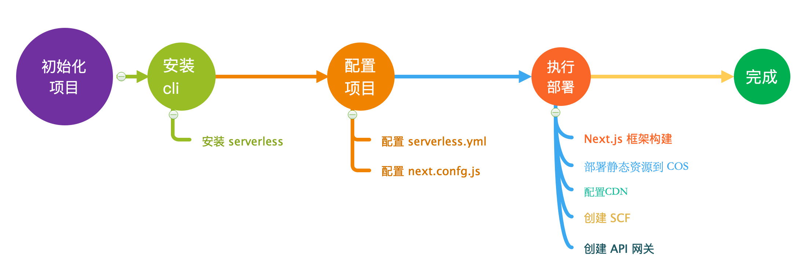
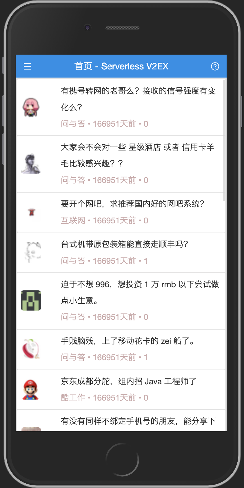

# Serverless V2EX

[在线预览](https://v2ex.yuga.chat)

使用 Next.js + TypeScript 开发，并且基于 Serverless 部署的 v2ex 客户端

## 流程图



## 功能

- [x] Typescript
- [x] Next.js
- [x] 自定义 Express Server
- [x] SSR Cache [cacheable-response](https://github.com/Kikobeats/cacheable-response)
- [x] 基于 Serverless Next.js 组件部署
- [x] **静态资源分离，自动部署到 COS**
- [x] **自动为静态 COS 配置 CDN**
- [x] **node_modules 基于层部署，大大提高部署效率**

## 展示



## 本地开发

```bash
$ npm install

$ npm run dev
```

## 构建

```bash
$ npm run build
```

## 配置

在部署到 Serverless 前，将 `.env.example` 重命名为 `.env`，并请完成如下配置：

```dotenv
# 腾讯云授权密钥
TENCENT_APP_ID=xxx
TENCENT_SECRET_ID=xxx
TENCENT_SECRET_KEY=xxx

# 部署地区
REGION=ap-guangzhou

# 静态资源上传 COS 桶名称
BUCKET=serverless-v2ex

# API 网关自定义域名 和 证书 ID
APIGW_CUSTOM_DOMAIN=v2ex.yuga.chat
APIGW_CUSTOM_DOMAIN_CERTID=xxx

# CDN 域名，证书 ID
CDN_DOMAIN=static.v2ex.yuga.chat
CDN_DOMAIN_CERTID=xxx
```

> 注意：如果不需要使用 CDN，直接使用 COS 自动生成的域名，也是可以的，只需要删除
> `serverless.yml` 中的 `cdnConf` 即可。

## 部署

此项目会先将 `node_modules` 部署到
[层](https://cloud.tencent.com/document/product/583/40159)，然后在部署项目代码，
这样下次部署项目时，如果 `node_modules` 没有修改，我们就不需要部署庞大的
`node_modules` 文件夹了。

1. 部署层:

```bash
$ npm run deploy:layer
```

> 注意：如果项目 `node_modules` 没有变更，就不需要执行此命令。

2. 部署业务代码：

```bash
$ npm run deploy
```

## License

MIT
